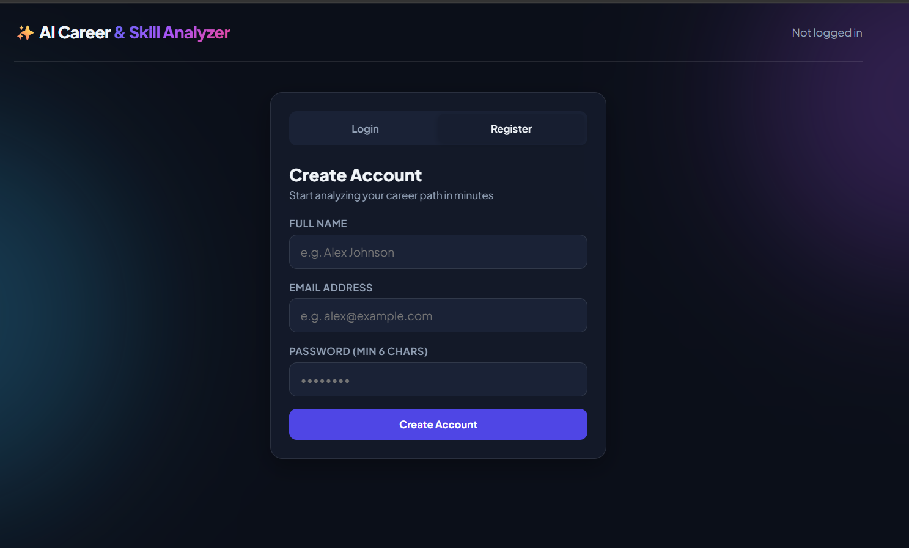
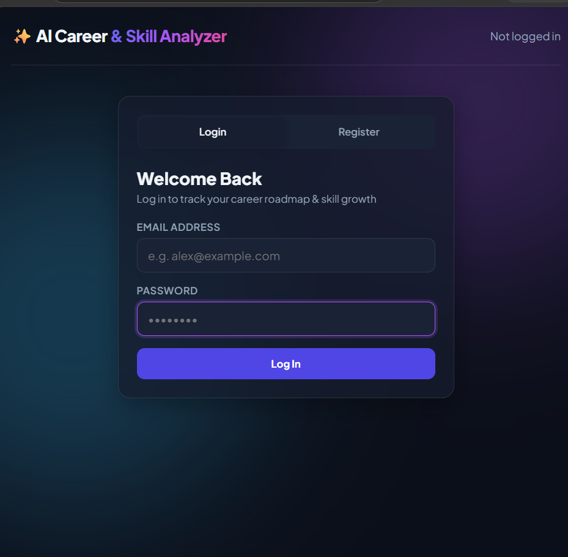
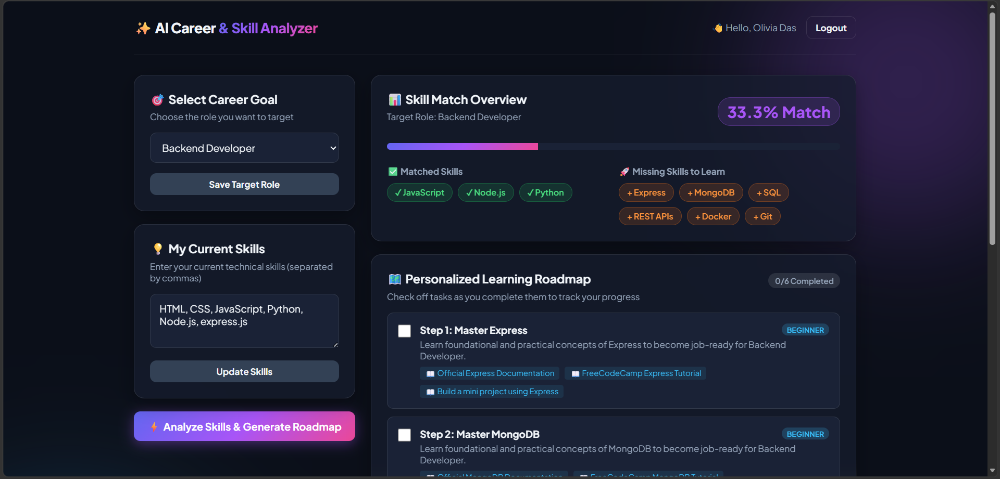
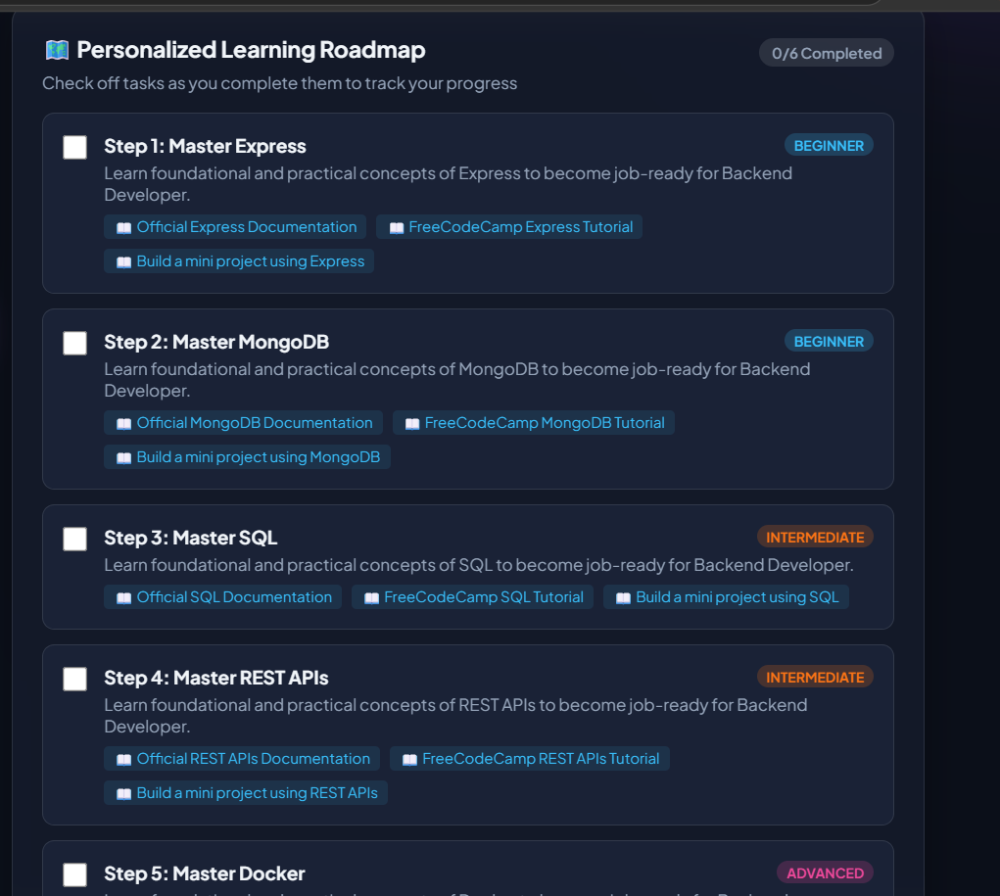

# 🚀 AI Career & Skill Analyzer

An AI-powered career and skill analysis platform that helps users understand their current skills, identify skill gaps, and create a personalized learning roadmap.

## ✨ Features

- 🔐 User Registration & Login
- 👤 User Profile Management
- 🎯 Career Goal Selection
- 📊 Skill Gap Analysis
- 🐍 Python-based Skill Analysis
- 🗺️ Personalized Learning Roadmap
- 📈 Progress Tracking

## 🛠️ Tech Stack

### Backend
- Node.js
- Express.js
- JavaScript

### Database
- MongoDB
- Mongoose

### Python Service
- Python
- FastAPI

### Frontend
- HTML
- CSS
- JavaScript

## 🏗️ Architecture

```text
Frontend
   ↓
Node.js + Express.js
   ↓
MongoDB

Express.js
   ↓
Python FastAPI
   ↓
Skill Analysis
   ↓
Express.js
   ↓
Frontend
```

## 📸 Screenshots

### 🔐 Registration



### 🔑 Login



### 📊 Dashboard



### 🎯 Skill Analysis


### 🗺️ Learning Roadmap



### 📈 Progress Tracking


## ⚙️ Installation

### 1. Clone the repository

```bash
git clone https://github.com/Absoluteolivia/AI-Career-Skill-Analyzer.git
cd AI-Career-Skill-Analyzer
```

### 2. Install dependencies

```bash
npm install
```

### 3. Environment Variables

Create a `.env` file in the project root:

```env
MONGO_URI=your_mongodb_connection
JWT_SECRET=your_secret_key
```

> Never upload your real `.env` file or secret keys to GitHub.

### 4. Run the Node.js server

```bash
node server.js
```

The application will run on your local server.

### 5. Run the Python service

Go to the Python service folder:

```bash
cd python_service
```

Install the required packages:

```bash
pip install -r requirements.txt
```

Then start the Python service according to the configuration in the project.

## 🎯 Project Goal

The goal of this project is to help users understand their current skills, identify missing skills for their desired career, and follow a personalized roadmap to improve their career readiness.

## 🔮 Future Improvements

- 🤖 AI-powered recommendations
- 📄 Resume analysis
- 🔗 GitHub profile analysis
- 💼 Job recommendations
- 🧠 Advanced skill prediction
- ☁️ Cloud deployment

## 👩‍💻 Author

**Olivia Das**

GitHub: [Absoluteolivia](https://github.com/Absoluteolivia)
